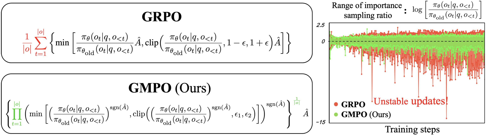

<div align=center>
  
# Geometric-Mean Policy Optimization
</div>

This is the official implementaion of paper [***Geometric-Mean Policy Optimization***](https://arxiv.org/abs/2507.20673). This repository contains Pytorch training code, evaluation code, pre-trained models, and visualization method.

<div align=center>

[](https://arxiv.org/abs/2507.20673)


[](LICENSE)
</div>


<div align=center>

</div>


## 1. Contents
- Geometric-Mean Policy Optimization
  - [1. Contents](#1-contents)
  - [2. Introduction](#2-introduction)
  - [3. Code Usage](#4-code-usage)
  - [4. Contacts](#5-contacts)
  - [5. Acknowledgment](#6-acknowledgment)
  - [6. Citation](#7-citation)

## 2. Introduction

Recent advancements, such as Group Relative Policy Optimization (GRPO), have enhanced the reasoning capabilities of large language models by optimizing the arithmetic mean of token-level rewards. However, GRPO suffers from unstable policy updates when processing tokens with outlier importance-weighted rewards, which manifests as extreme importance sampling ratios during training, i.e., the ratio between the sampling probabilities assigned to a token by the current and old policies. In this work, we propose Geometric-Mean Policy Optimization (GMPO), a stabilized variant of GRPO. Instead of optimizing the arithmetic mean, GMPO maximizes the geometric mean of token-level rewards, which is inherently less sensitive to outliers and maintains a more stable range of importance sampling ratio. In addition, we provide comprehensive theoretical and experimental analysis to justify the design and stability benefits of GMPO. Beyond improved stability, GMPO-7B outperforms GRPO by an average of 4.1% on multiple mathematical benchmarks and 1.4% on multimodal reasoning benchmark, including AIME24, AMC, MATH500, OlympiadBench, Minerva, and Geometry3K.

## 3. Code Usage

Download the base model first: Qwen2.5-Math-7B, Qwen2.5-Math-1.5B
```
conda create -n gmpo python==3.10
conda activate gmpo
pip install vllm==0.8.4 && pip install oat-llm==0.1.3.post1
cd understand_r1_zero_main
pip install -e .

bash scripts/qwen2.5-math-7b-gmpo.sh
```

## 4. Contacts
If you have any question about our work or this repository, please don't hesitate to contact us by emails or open an issue under this project.
- [zhaoyuzhong20@mails.ucas.ac.cn](zhaoyuzhong20@mails.ucas.ac.cn)
- [liuyue171@mails.ucas.ac.cn](liuyue171@mails.ucas.ac.cn)
- [lecu@microsoft.com](lecu@microsoft.com)
- [wanfang@ucas.ac.cn](wanfang@ucas.ac.cn)

## 5. Acknowledgment

- Part of the code is borrowed from [understand-r1-zero](https://github.com/sail-sg/understand-r1-zero), we sincerely thank them for their contributions to the community.

## 6. Citation

@misc{zhao2025geometricmeanpolicyoptimization,
      title={Geometric-Mean Policy Optimization}, 
      author={Yuzhong Zhao and Yue Liu and Junpeng Liu and Jingye Chen and Xun Wu and Yaru Hao and Tengchao Lv and Shaohan Huang and Lei Cui and Qixiang Ye and Fang Wan and Furu Wei},
      year={2025},
      eprint={2507.20673},
      archivePrefix={arXiv},
      primaryClass={cs.CL},
      url={https://arxiv.org/abs/2507.20673}, 
}